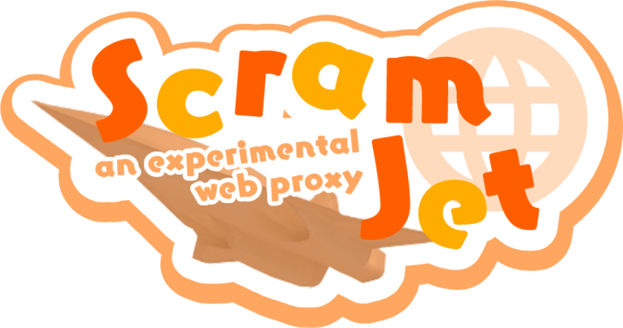

<h1 align="center">Sherpa</h1>
<div align="center">
  
</div>

<div align="center">
  
  
</div>

---

> **Fork notice:** Sherpa is a fork of [Mercury Workshop's Scramjet](https://github.com/MercuryWorkshop/scramjet) (the `legacy`/1.x line), licensed AGPL-3.0-only. This fork currently tracks Scramjet's behavior as a rebrand-only baseline; modifications beyond renaming are tracked in this repo's commit history. All credit for the original design and implementation goes to Mercury Workshop.

Sherpa is an interception-based web proxy designed to bypass arbitrary web browser restrictions, support a wide range of sites, and act as middleware for open-source projects. It prioritizes security, developer friendliness, and performance.

## Supported Sites

Sherpa has CAPTCHA support! Some of the popular websites that Sherpa supports include:

- [Google](https://google.com)
- [Twitter](https://twitter.com)
- [Instagram](https://instagram.com)
- [Youtube](https://youtube.com)
- [Spotify](https://spotify.com)
- [Discord](https://discord.com)
- [Reddit](https://reddit.com)
- [GeForce NOW](https://play.geforcenow.com/)

Ensure you are not hosting on a datacenter IP for CAPTCHAs to work reliably along with YouTube. Heavy amounts of traffic will make some sites NOT work on a single IP. Consider rotating IPs or routing through Wireguard using a project like <a href="https://github.com/whyvl/wireproxy">wireproxy</a>.

## Development

### Dependencies

- Recent versions of `node.js` and `pnpm`
- `rustup`
- `wasm-bindgen`
- [Binaryen's `wasm-opt`](https://github.com/WebAssembly/binaryen)
- [this `wasm-snip` fork](https://github.com/r58Playz/wasm-snip)

#### Building

- Clone the repository with `git clone https://github.com/bitball41/sherpa`
- Install the dependencies with `pnpm i`
- Build the rewriter with `pnpm rewriter:build`
- Build Sherpa with `pnpm build`

### Running Sherpa Locally

You can run the Sherpa dev server with the command

```sh
pnpm dev
```

Sherpa should now be running at <http://localhost:1337> and should rebuild upon a file being changed (excluding the rewriter).

### Setting up Typedoc

Typedoc generation is inherited from upstream but is not yet hosted for this fork.

You can run it locally with:

```
pnpm run docs
pnpm docs:dev
pnpm docs:serve
```

### Set up everything

Do you want to run the Sherpa demo and Typedoc together like what is served on GitHub Pages by the Action?

You can do this by running the serve script:

```sh
chmod +x scripts/serve-static.sh
./scripts/serve-static.sh
```

This essentially simulates the CI pipeline, but in a shell script.

## Resources

- [TN Docs for Scramjet](https://docs.titaniumnetwork.org/proxies/scramjet) - Documents the upstream Scramjet API that Sherpa currently mirrors; useful until Sherpa diverges and gets its own docs.
- [Upstream Scramjet](https://github.com/MercuryWorkshop/scramjet) - The original project this fork is based on.
